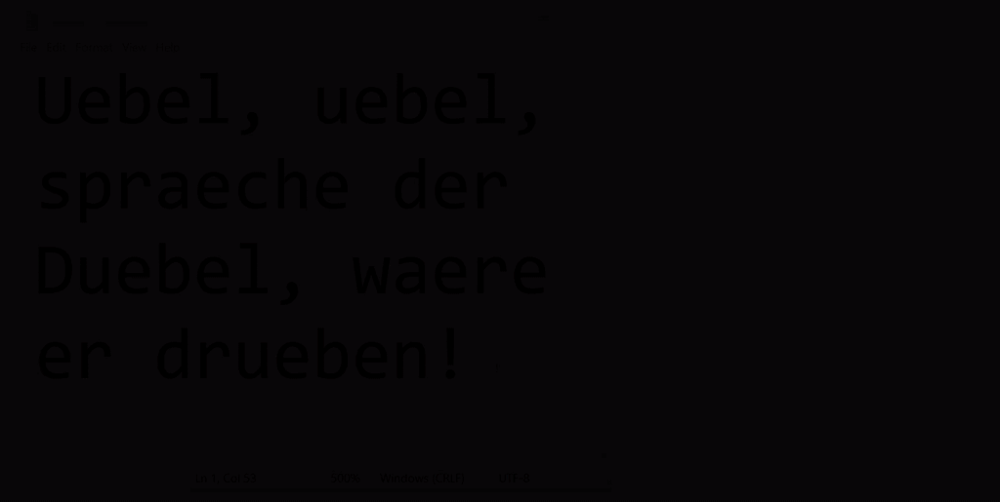

# betterletter

In a given text, replaces alternative spellings of native characters with their proper spellings[^1]:



## Installation

```shell
pip install betterletter
```

## Usage

The package [will install a Python script of the same name](https://python-poetry.org/docs/pyproject/#scripts), so instead of the usual `python -m betterletter`, you can simply invoke that directly, if the Python script directory is on your `$PATH`:

```bash
$ betterletter -h
usage: betterletter [-h] [-c] [-f] [-r] [-g] [-d] [--debug] {de}

Tool to replace alternative spellings of native characters (e.g. German
umlauts [ä, ö, ü] etc. [ß]) with the proper native characters. For example,
this problem occurs when no proper keyboard layout was available. This program
is dictionary-based to check if replacements are valid words. By default,
reads from STDIN and writes to STDOUT.

positional arguments:
  {de}             Text language to work with, in ISO 639-1 format.

options:
  -h, --help       show this help message and exit
  -c, --clipboard  Read from and write back to clipboard instead of
                   STDIN/STDOUT.
  -f, --force      Force substitutions and return the text version with the
                   maximum number of substitutions, even if they are illegal
                   words (useful for names).
  -r, --reverse    Reverse mode, where all native characters are simply
                   replaced by their alternative spellings.
  -g, --gui        Stop and open a GUI prompt for confirmation before
                   finishing.
  -d, --diff       Print a diff view of the substitutions to stderr.
  --debug          Output detailed logging information.
```

### Usage Examples

Normal usage:

```bash
$ echo 'Hoeflich fragen waere angebracht!' | betterletter de
Höflich fragen wäre angebracht!
```

Reverse it:

```bash
$ echo 'Höflich fragen wäre angebracht!' | betterletter --reverse de
Hoeflich fragen waere angebracht!
```

A diff view, useful for longer text and to confirm correctness.
The [diff](https://docs.python.org/3/library/difflib.html) is written to STDERR so won't interfere with further redirection.

```bash
$ echo 'Hoeflich fragen waere angebracht!' | betterletter --diff de 2> diff.txt
Höflich fragen wäre angebracht!
$ cat diff.txt
- Hoeflich fragen waere angebracht!
?  ^^              ^^
+ Höflich fragen wäre angebracht!
?  ^              ^
```

The tool may be coerced into working with names:

```bash
$ # A name won't be in the dictionary:
$ echo 'Sehr geehrte Frau Huebenstetter, ...' | betterletter de
Sehr geehrte Frau Huebenstetter, ...
$ # But we can force it to work:
$ echo 'Sehr geehrte Frau Huebenstetter, ...' | betterletter --force de
Sehr geehrte Frau Hübenstetter, ...
```

[Clipboard-based](https://pypi.org/project/pyperclip/) workflows are also possible:

```bash
# Nothing happens: clipboard is read and written to silently.
# Paste the processed version from your clipboard.
$ betterletter --clipboard de
```

## Background

For example, German native characters and their corresponding alternative spellings (e.g. when no proper keyboard layout is at hand, or ASCII is used) are:

| Native Character | Alternative Spelling |
| :--------------: | :------------------: |
|       Ä/ä        |        Ae/ae         |
|       Ö/ö        |        Oe/oe         |
|       Ü/ü        |        Ue/ue         |
|       ẞ/ß        |        SS/ss         |

These pairings are recorded [here](https://github.com/alexpovel/betterletter/blob/master/betterletter/resources/languages.json).

Going from left to right is simple: replace all native characters with their alternative spellings, minding case.
That use case is also supported by this tool (`reverse` flag).

The other direction is much less straightforward: there exist countless words for which alternative spellings occur somewhere as a pattern, yet replacing them with the corresponding native character would be wrong:

| Character | Correct Spelling  | Wrong Spelling |
| --------- | ----------------- | -------------- |
| *Ä*       | **Ae**rodynamik   | Ärodynamik     |
| *Ä*       | Isr**ae**l        | Isräl          |
| *Ä*       | Schuf**ae**intrag | Schufäintrag   |
| *Ö*       | K**oe**ffizient   | Köffizient     |
| *Ö*       | Domin**oe**ffekt  | Dominöffekt    |
| *Ö*       | P**oet**          | Pöt            |
| *Ü*       | Abente**ue**r     | Abenteür       |
| *Ü*       | Ma**ue**r         | Maür           |
| *Ü*       | Ste**ue**rung     | Steürung       |
| *ß*       | Me**ss**gerät     | Meßgerät       |
| *ß*       | Me**ss**e         | Meße           |
| *ß*       | Abschlu**ss**     | Abschluß       |

just to name a few, pretty common examples.

As such, this tool is based on a dictionary lookup, see also the [containing directory](https://github.com/alexpovel/betterletter/blob/master/betterletter/resources/dicts/).

## Long-form samples

See also the [tests](https://github.com/alexpovel/betterletter/blob/master/tests/).

### de

The input:

> Ueberhaupt braeuchte es mal einen Teststring.
> Saetze ohne Bedeutung, aber mit vielen Umlauten.
> DRPFA-Angehoerige gehoeren haeufig nicht dazu.
> Bindestrich-Woerter spraechen Baende ueber Fehler.
> Doppelgaenger-Doppelgaenger sind doppelt droelfzig.
> Oder Uemlaeuten? Auslaeuten? Leute gaebe es, wuerde man meinen.
> Ueble Nachrede ist naechtens nicht erlaubt.
> Erlaube man dieses, waere es schoen uebertrieben.
> Busse muesste geloest werden, bevor Gruesse zum Gruss kommen.
> Busse sind Geraete, die womoeglich schnell fuehren.
> Voegel sind aehnlich zu Oel.
> Hierfuer ist fuer den droegen Poebel zu beachten, dass Anmassungen zu Gehoerverlust fuehren koennen.
> Stroemelschnoesseldaemel!

is turned into:

> Überhaupt bräuchte es mal einen Teststring.
> Sätze ohne Bedeutung, aber mit vielen Umlauten.
> DRPFA-Angehörige gehören häufig nicht dazu.
> Bindestrich-Wörter sprächen Bände über Fehler.
> Doppelgänger-Doppelgänger sind doppelt droelfzig.
> Oder Uemlaeuten? Auslaeuten? Leute gäbe es, würde man meinen.
> Üble Nachrede ist nächtens nicht erlaubt.
> Erlaube man dieses, wäre es schön übertrieben.
> Buße müsste gelöst werden, bevor Grüße zum Gruß kommen.
> Buße sind Geräte, die womöglich schnell führen.
> Vögel sind ähnlich zu Öl.
> Hierfür ist für den drögen Pöbel zu beachten, dass Anmaßungen zu Gehörverlust führen können.
> Stroemelschnoesseldaemel!

---

Note that some corrections are out of scope for this little script, e.g.:

> Busse

In German, *Busse* and *Buße* are two words of vastly different meaning (*busses* and *penance*, respectively).
Unfortunately, they map to the same alternative spelling of *Busse*.
The tool sees *Busse* (meaning *just that*, with no intent of changing it), notices *Buße* is a legal substitution, and therefore makes it.
The tool has no awareness of context.

Turning substitutions like these off would mean the tool would no longer emit *Buße*, ever.
This could be as undesirable as the current behaviour.
There seems to be no easy resolve.

## Development

This project uses [poetry](https://python-poetry.org/) for dependency management.
Refer to the [poetry config file](https://github.com/alexpovel/betterletter/blob/master/pyproject.toml) for more info (e.g. the required Python modules to install if you don't want to deal with `poetry`).

Using poetry, from the project root, run:

```bash
# Installs virtual environment according to lock file (if available in repo),
# otherwise pyproject.toml:
poetry install
# Run command within that environment:
poetry run python -m betterletter -h
```

Development tasks are all run through `poetry`, within the context of the virtual environment.

Run [`just`](https://github.com/casey/just) (without arguments) for more available commands related to development.

## AutoHotKey

This tool can be integrated with [AutoHotKey](https://www.autohotkey.com/), allowing you to use it at the touch of a button.
This can be used to setup a keyboard shortcut to run this tool in-place, quickly replacing what you need without leaving your text editing environment.

The AutoHotKey file is [here](https://github.com/alexpovel/betterletter/blob/master/betterletter.ahk) and **requires [AutoHotKey v2](https://www.autohotkey.com/v2/)** (check out commits 7dd68f9 and earlier for the AHK v1.1 script).

Follow [this guide](https://www.autohotkey.com/docs/FAQ.htm#Startup) to have the script launch on boot automatically.

[AHK try icon](icon.ico) generated using <https://favicon.io/favicon-generator/>.

[^1]: In this demo, `Ctrl + C` and `Ctrl + V` are inserted automatically using the [AutoHotKey script](#autohotkey).
  The user only selects the desired text and presses the hotkey, amounting to two keystrokes.
  The delay between the `Ctrl + C` and `Ctrl + V` keystrokes in the above demo is the script actually doing its work.
  First, the script reads in a dictionary from disk, taking constant time (*O(1)*), aka it doesn't scale with input size, just dictionary size.
  Sadly, this takes comparatively long for short texts.
  However, the script scales acceptably with longer inputs (regular *O(n)*).
  **Very long inputs are required for the actual processing to take longer than the initial dictionary I/O.**
  Hence, this script could run very fast if it were (re-)designed as a daemon, with the dictionary preloaded in memory.
